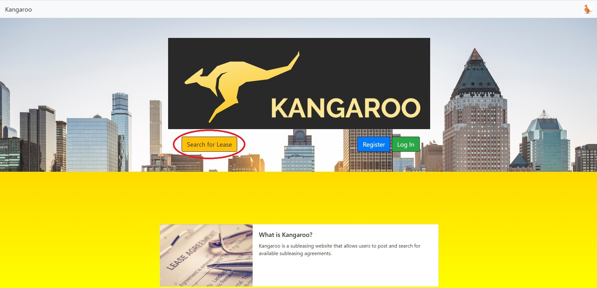
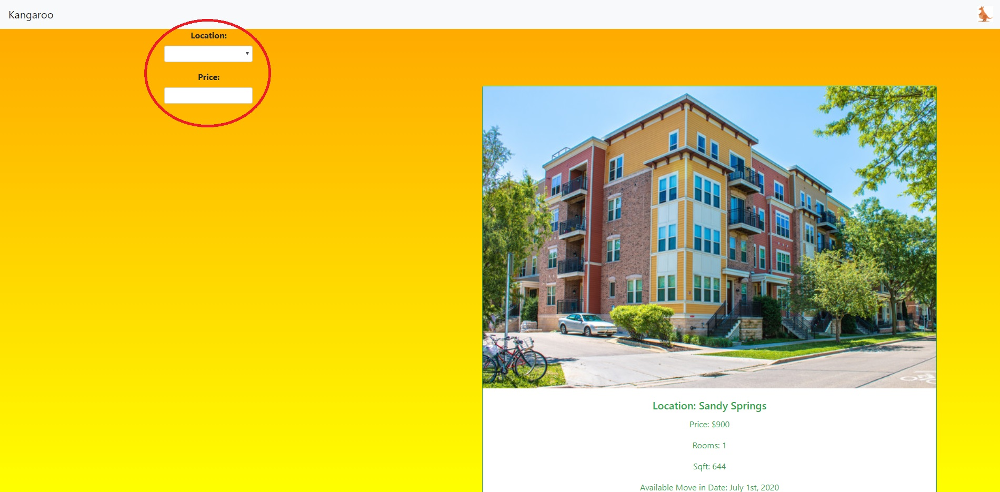
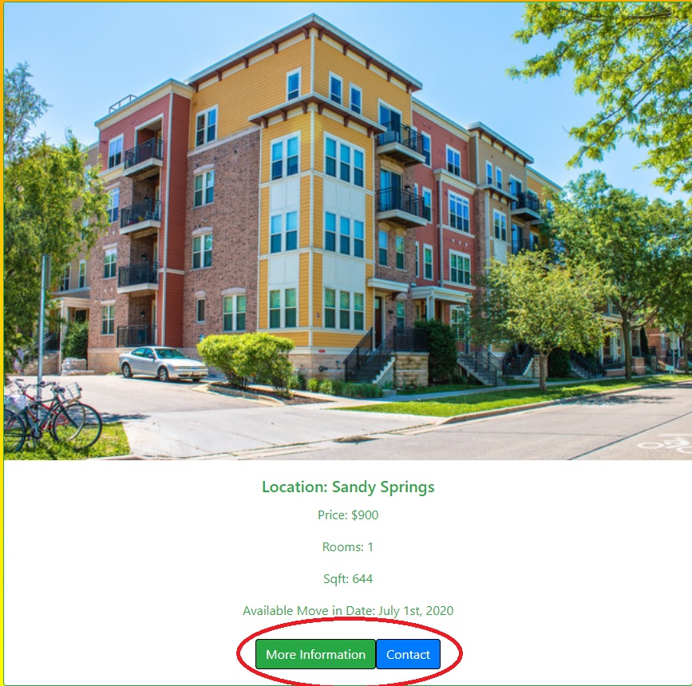
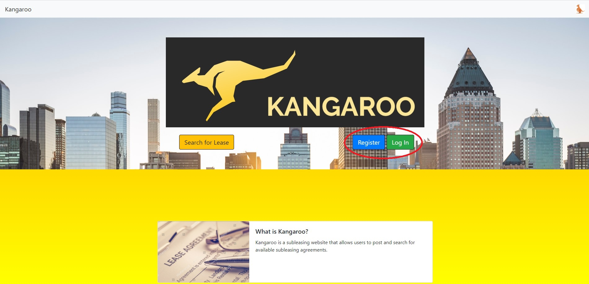
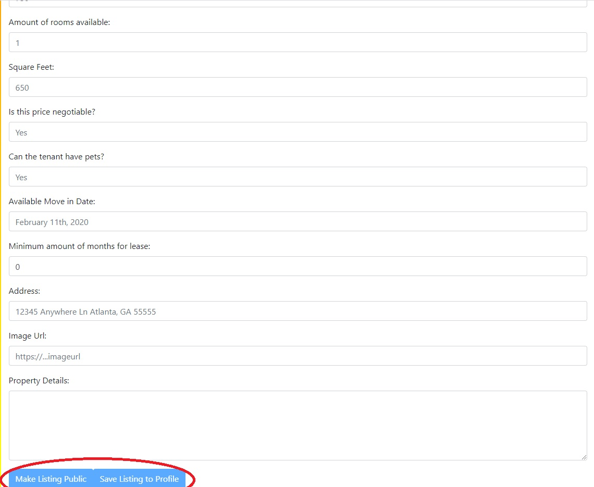

# Kangaroo: Adopt-A-Lease

Kangaroo App Link: https://kangarooleasing.herokuapp.com

## Overview

- Kangaroo is a platfrom through which users can find existing leases for living accomodations and adopt them. It brings together leaseholders or landlords and those looking for somewhere to stay for at least 2 months in the Metro Atlanta area. Simply search for a place using different criteria (leasers), or list a place whose lease is up for grabs (leaseholders).

### Developers

- Isimemen Inegbedion | https://github.com/illimitableissi
- Colin Green | https://github.com/colin-green
- Andrew Fowose | https://github.com/usafowose

## Heroku Deployment

- https://kangarooleasing.herokuapp.com/

## Searching for a Lease

- Simply click on this button to get started:

- Then, you can filter the available listings by location and price.

- For each listing, you can find out more information or leave your contact info with the leaseholder.

## Posting a Lease

- To begin, you'll need an account, so you'll need to register or login using these buttons:

- Once logged in, you can see your listings, and there is a button for creating a listing. You can either make the listing public, or save it privately to your profile.

